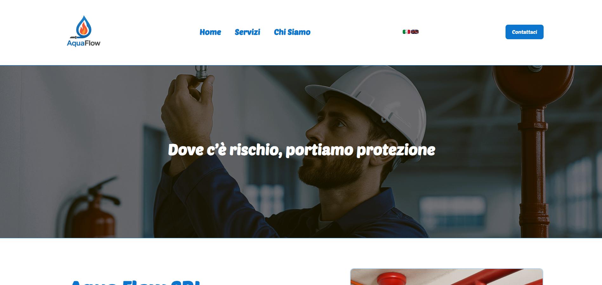
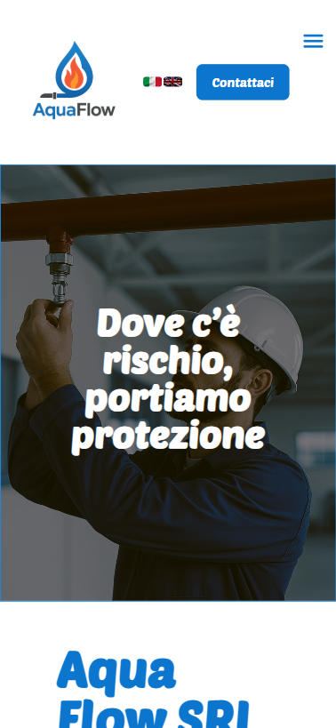
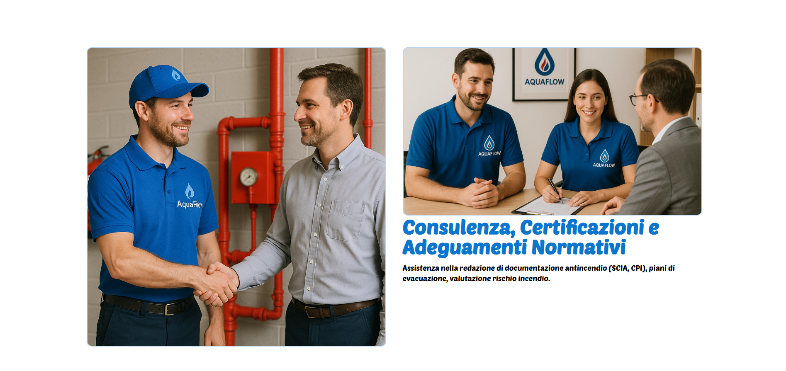
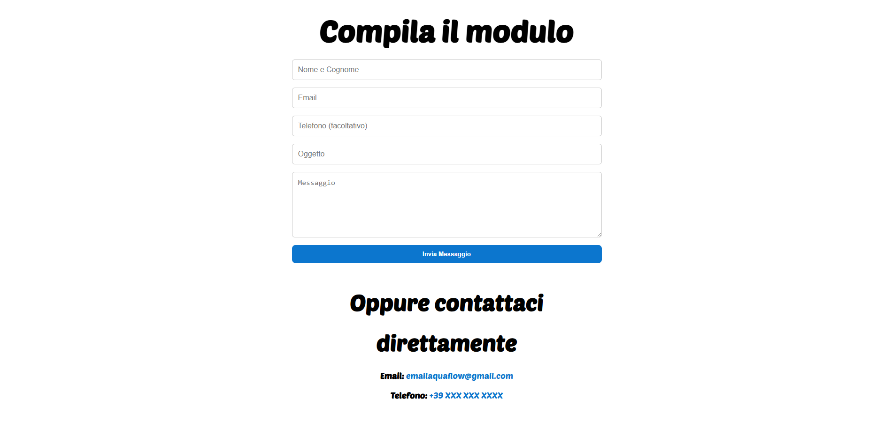

AquaFlow - Sito Web Aziendale (Demo)

> **Demo statica** basata su un vero progetto aziendale

---

## 📌 Descrizione

AquaFlow è un sito web responsive per un'azienda immaginaria del settore idrico.  
È stato sviluppato per mostrare competenze in **HTML**, **CSS** e **JavaScript** e per illustrare una struttura professionale per un sito vetrina aziendale.

---

## 🛠️ Tecnologie utilizzate

- HTML5
- CSS3
- JavaScript
- Responsive Design (mobile-first)

---

## 🌐 Anteprima del Sito

### 🏠 Homepage

### 📱 Menu Mobile

### 🧯 Servizi

### ✉️ Contattaci

---

